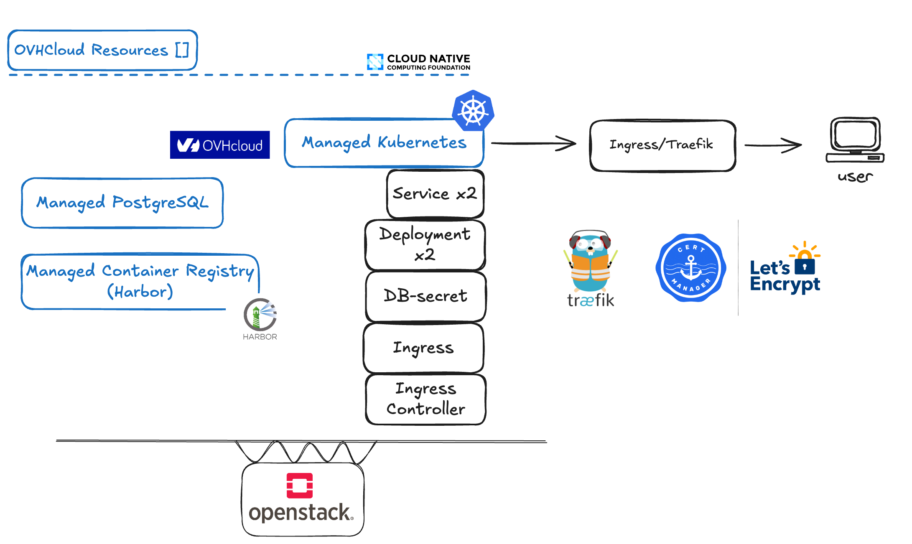

# OVHCloud Workshop

bla..bla..bla..

## Prerequisites

- `docker` (Docker/Colima or similar)
- `kubectl` (https://kubernetes.io/docs/tasks/tools/)
- `helm` (https://helm.sh/docs/intro/install/)

## Workshop exercises

This workshop consist of three parts. When you have completed all the parts you should have a working TODO-application exposed over HTTPS and whose backend writes data to a managed OVHCloud database instance.

[Part 1 - Setup OVHCloud Resource](ovhsetup.md)

[Part 2 - Kubernetes setup](kubernetessetup.md)

[Part 3 - Deploy applications](deploy.md)

